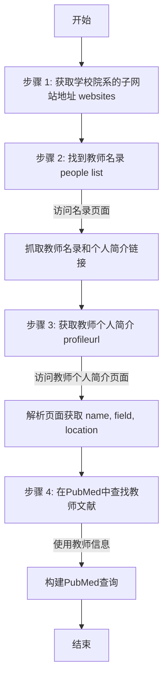

# STEPS

## websites

> 每个学校院系下的子网站地址websites，然后找到people list 

## people list

> 教师名录表，每一个教师都是一个超链接，然后可以跳转到对应的教师的个人简介profileurl

## profileurl

> 教师个人简介页面，每个教师有各自的简介页面，通过检索这个页面，然后获取到name，field，location等属性

## pubmed 🆗

> 待做：查找是否有pubmed API，在pubmed中查找对应教师的文献等

